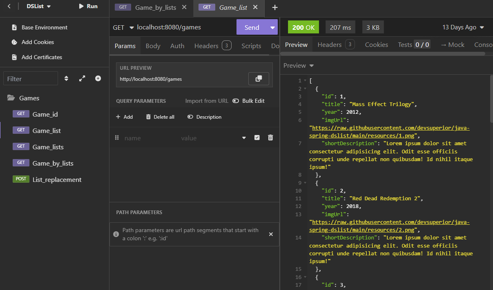

# Dslist
Projeto desenvolvido no evento organizado pela [DevSuperior](https://devsuperior.com.br)

## 📋 Sobre o projeto
É uma aplicação back end construída com padrão REST para API web que retorna dados sobre games e a lista que estão incluídos

## 🗃️ Arquitetura
- **Padrão Camadas**: Controller, service, repository
- **Padrão DTO** (Data Transfer Object)

## 📊 Modelo Conceitual

## ☑️ API em funcionamento (Insomnia)
### Endpoint GET /games

## 🛠️ Tecnologias utilizadas:
- **Linguagem**: Java
- **Gerenciamento de dependência**: Maven
- **Banco de dados**: SQL
- **Framework**: Spring Boot
- **Bancos utilizados**: H2 (desenvolvimento) e Postgresql (produção)

## 🐳 Ambiente Local com Docker Compose
O projeto inclui configuração Docker Compose para configurar e executar um container do Postgresql e PgAdmin, eliminando a necessidade de instalação local do banco de dados

## 👩‍💻 Autora
Luana Costa Vasconcelos

[Linkedin](https://www.linkedin.com/in/luana-costa-vasconcelos)
